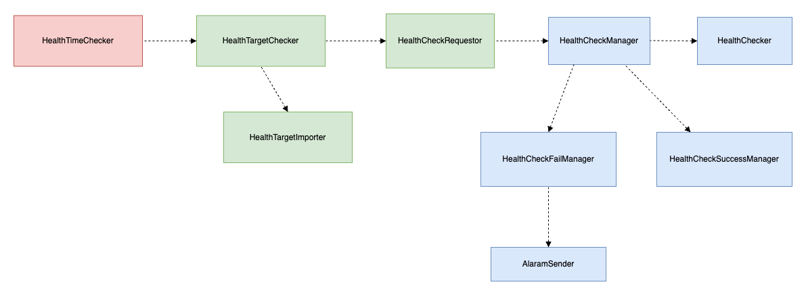

# health-checking

---

클라우드 환경에 서버를 배포하고 난 후 알 수 없는 이유로 왕왕 서버가 내려가 있었다.

이를 해결하기위한 방법으로는 
- 직접 접속하여 커맨드를 통해 작동하고 있는지 확인한다.
- 클라우드 서비스 중 헬스체크 기능을 사용한다.
- 직접 서비스에 접속하여 확인한다.
- 직접 헬스체크 서버를  구현한다.

직접 서버 헬스 체크 기능을 구현하여 서버가 다운시 사용자의 이메일로 알림을 보내어 

이 문제를 해결해보자

# 첫번째 해결 방법

--- 

개요 : 동기 호출 , 로컬 캐싱 , 큐 초기화를 통한 동기 화

- 활성화 서버를 로컬 우선순위 큐로 삽입합니다.
- **1 분마다** 우선순위 큐를 검사하여 헬스 체크를 수행합니다.
- 헬스 체크를 수행은 동기적으로 내부 HealthCheckManager 를 호출하여 수행합니다.
- 서버 비활성화 , 새로운 활성화 서버 등록 등 DB 변화가 생긴 후 큐를 동기화 하는 작업은 **30분마다** 기존의 큐를 비우고 새로운 큐를 생성합니다.   

## 기능

### Check Queue

하나의 쓰레드가 **1분마다** 우선순위 큐를 체크합니다.

- 큐에 있는 대상 서버가 현재 시간과 동일한 경우 헬스체크를 실시합니다.
- 헬스 체크를 실시하기전에 큐에서 꺼내어 서버가 설정한 헬스 체크 간격 만큼 시간을 업데이트한 후 큐에 삽입합니다.

### Synchronize Queue

- **30분** 마다 검사하는 클래스를 재호출해주며 동기화를 수행해줍니다.
- 기존의 큐를 비우고 새로운 호출로 DB 로부터 활성화된 서버를 새롭게 큐로 삽입합니다. 

### health Check

- 약속된 서버에 요청을 보내고 정상 응답인지를 확인합니다.
- 정상 응답이라면 정상응답을 저장하고 종료합니다.
- 정상 응답이 아니라면 3번 연속시도 후 그럼에도 실패시 메일로 알람을 보내고 실패응답을 저장하고 종료합니다.

### Send Mail
- Server Checking 실패 후 사용자 이메일로 실패 이메일을 보낸다.
- 연속 두번 실패시 더이상 보내지 않으며 비활성화 상태로 전환합니다.

## 장점

- 로컬 큐를 사용함으로써 헬스 체크 서버 대상에 빠르게 접근할 수 있습니다.

## 단점

- 로컬 큐를 사용하기 때문에 헬스 체크 서버 대상이 늘어날 경우 메모리 부족으로 이어질 수 있습니다.
- 헬스 체크 기능을 동기적으로 수행하기 때문에 헬스 체크 서버 대상이 늘어날 경우 요청이 지연될 수 있습니다.
- 동기화 과정이 필요없는 경우에도 동기화를 수행합니다.

---

# 클래스 관계

- HealthTimeChecker : 1분 마다 큐를 검사할 HealthTargetChecker 를 비동기 호출한다.
- HealthTargetImporter: 활성화된 서버  정보를 가져오는 역할을 가집니다.
- HealthTargetChecker : 큐에 있는 헬스 체크 대상 서버를 체크하고  HealthCheckRequester 를 호출하는 역할을 가집니다.
- HealthCheckRequester : 대상 서버에 헬스 기능을 호출하는 역할을 가집니다.
- HealthCheckInitializer : 활성화된 서버를 우선순위 큐를 초기화하는 역할을 가집니다.
- HealthCheckManager : 헬스 체크를 호출하고 성공과 실패 Manager 를 호출하는 역할을 가집니다.
- HealthChecker : 헬스 체크하는 역할을 담당합니다.
- HealthCheckSuccessManager : 헬스 체크가 성공했을 때 성공 레코드를 저장하는 역할을 가집니다.
- HealthCheckFailManager : 헬스 체크가 실패했을 때 실패 레코드를 저장하고 알람을 보내는 역할을 가집니다.

# 시퀀스 다이어그램

---
## check queue , Synchronize queue

1. HealthTimeChecker 가 1분마다 HealthTargetChecker 를 비동기 호출하여 검사에 지연이 발생하지 않도록합니다. 
2. HealthTargetChecker 는 HealthTargetImporter 로 부터 서버 정보를 담고 있는 큐를 초기화하거나 동기화합니다. 
3. HealthTargetImporter 는 활성화된 서버를 가져옵니다. 
4. HealthTargetChecker 는 서버 정보를 담고 있는 큐를 확인하여 체크 대상 서버에 대해 HealthCheckRequester 호출하여 헬스 체크를 수행해줍니다. 
5. HealthCheckRequester 는 동기적으로 헬스 체크를 수행합니다.

## health check , sendMail

- 성공 시
1. HealthCheckManager 는 HeathChecker 를 호출하여 서버에 실제 호출을 수행합니다.
2. 헬스 체크 성공 시 성공 레코드를 저장합니다.

- 실패 시
1. HealthCheckManager 는 HeathChecker 를 호출하여 서버에 실제 호출을 수행합니다.
2. 헬스 체크 살패 시 성공 레코드를 저장하고 종료합니다.
3. 실패 알람을 서버를 등록한 사용자 이메일로 보냅니다.